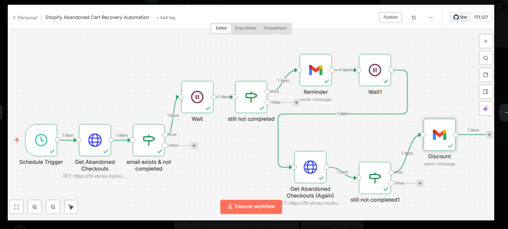

# Shopify Abandoned Cart Recovery Automation (n8n)

This workflow helps recover lost sales by automatically sending follow-ups to users who abandoned their carts.

## 🔹 Features:
- Detects abandoned carts
- Sends automated reminders (Email / WhatsApp)
- Increases conversion rate
- Tracks responses

## 🔹 Tools Used:
- n8n
- Shopify
- Email / WhatsApp API

## 🔹 Workflow Steps:
1. Trigger when cart is abandoned
2. Wait for a specific time (e.g. 1 hour)
3. Send reminder message
4. Log data in Google Sheets

## 🔹 Preview:

# 🛒 Shopify Abandoned Cart Recovery Automation (n8n)

## 🚀 Overview
This workflow automatically detects abandoned carts and sends follow-up messages to recover lost sales.

---

## ⚙️ Tools Used
- n8n
- Shopify
- Email / API

---

## 💡 Features
- Detects abandoned carts automatically
- Sends follow-up reminders to customers
- Helps increase conversion rate
- Reduces manual effort

---

## 🔄 Workflow Process
1. Detect abandoned cart event
2. Wait for a specific time (e.g. 1 hour)
3. Send reminder message
4. Track response / log data

---

## 📸 Workflow

---

## 🎯 Use Case
Perfect for Shopify stores looking to recover lost revenue.

---

## 🚀 Benefits
- Increases sales
- Saves time
- Improves customer engagement

---

## 📩 Need this automation?

If you want a similar system for your business, feel free to contact me.

🔗 Fiverr: https://www.fiverr.com/automationte387
🔗 Upwork: https://www.upwork.com/freelancers/~014bc64d5756b66b94
